# MYmicroC

---

- 课程名称：编程语言原理与编译
- 实验项目：期末大作业
- 专业班级：计算机1803
- 学生学号：31803224，31803224
- 学生姓名：沈科迪，林承毅
- 实验指导教师: 郭鸣
- [github地址](https://github.com/Sklud1456/my-MicroC)

## 简介

​	这是一个编译原理的大作业，主要是在microC的基础上完成的，所以取名为mymicroC。在对mircoc的源码阅读的过程中我们遇到了很多的困难，但经过各种文档的阅读和一些直接的试错之后还是渐渐理解了一些基本的思想，所以我们的想法是在microC的基础上舔砖加瓦，使其的特性逐步增加，使其向C语言逐步靠近，并且在其中我们也实现了一些C语言所没有的功能，在对编译原理的逐步深入了解之后，我们对于编程语言的内核也是有了更深层次的理解，慢慢理解了如何去增加一种功能。

## 文件说明

​	由于在阅读的时候，我们发现优化编译器更易于理解，所以我们舍弃了原本的编译器，直接在优化编译器上进行改进，同时也把多余的虚拟机删除了，只剩下一个java虚拟机。

### interpreter  解释器

```sh
Absyn.fs 						                            抽象语法
CLex.fsl 								                   fslex词法定义
CPar.fsy 							                       fsyacc语法定义
Parse.fs 				                                    语法解析器
Interp.fs 												 解释器
interpc.fsproj                                               项目文件
```

### compiler  优化编译器

```sh
Absyn.fs						                           抽象语法
CLex.fsl 							                       fslex词法定义
CPar.fsy								                  fsyacc语法定义
Contcomp.fs							                	  优化编译器
Machine.fs												生成指令集定义
microcc.fsproj                                          	优化编译器项目文件
```

### java虚拟机

```sh
Exception				                                  异常类
Type							                         类型类
Machine								                     java虚拟机
```


## 构建与执行

### A 解释器

#### 解释器 interpc.exe 构建

```sh
生成扫描器和分析器
dotnet "C:\Users\ASUS\.nuget\packages\fslexyacc\10.2.0\build\fslex\netcoreapp3.1\fslex.dll"  -o "CLex.fs" --module CLex --unicode CLex.fsl

dotnet "C:\Users\ASUS\.nuget\packages\fslexyacc\10.2.0\build\fsyacc\netcoreapp3.1\fsyacc.dll"  -o "CPar.fs" --module CPar CPar.fsy

# 编译解释器 interpc.exe 命令行程序 
dotnet restore  interpc.fsproj   # 可选
dotnet clean  interpc.fsproj     # 可选
dotnet build -v n interpc.fsproj # 构建./bin/Debug/net5.0/interpc.exe ，-v n查看详细生成过程

# 执行解释器
dotnet run -p interpc.fsproj example/ex1_2.c 8
dotnet run -p interpc.fsproj -g ex1.c 8  //显示token AST 等调试信息
```

### B 优化编译器

####  优化编译器 microcc.exe 构建步骤

```sh
生成扫描器和分析器
dotnet "C:\Users\ASUS\.nuget\packages\fslexyacc\10.2.0\build\fslex\netcoreapp3.1\fslex.dll"  -o "CLex.fs" --module CLex --unicode CLex.fsl

dotnet "C:\Users\ASUS\.nuget\packages\fslexyacc\10.2.0\build\fsyacc\netcoreapp3.1\fsyacc.dll"  -o "CPar.fs" --module CPar CPar.fsy

dotnet restore  microcc.fsproj
dotnet clean  microcc.fsproj
dotnet build  microcc.fsproj           # 构建编译器

dotnet run -p microcc.fsproj example/ex11.c    # 执行编译器
./bin/Debug/net5.0/microcc.exe ex11.c  # 直接执行

```

### C 虚拟机构建与运行

#### Java虚拟机的建立和运行

```sh
javac Machine.java	#生成java虚拟机
java Machine ex9.out 3	#用虚拟机运行out文件

javac Machinetrace.java
java Machinetrace ex9.out 0	#跟踪运行out文件
java Machine ../../example/ex1.out 1
```

## 功能实现

​	我们在写大作业的时候，由于解释器和编译器的实现方式略有不同，所以二者的实际运行代码会有些许的不同，我们打算之后再进行整合。

#### 编译器：

- float类型的实现

  - 原本的microC并没有float类型，我们添加了这一个类型。但是在编译之后发现，原本的C#虚拟机中的stack是用int型来当做存储空间，这就不能存储我们的float类型，而且我们对C#也不熟悉，很自然的，我们就想到了是用java面向对象的特性，建立一个basetype类型的stack，在根据传入的值进行对应的子类变换，变成int型或者float型。不过在out文件中，我们还是把float类型用net自带的函数System.BitConverter.SingleToInt32Bits转换成了bits类型，方便进行生成。
  - 例子：
  
    ```C
    // (ex1_1.c)
    void main(int n) {
      float a;
      float b;
      a = 1.5;
      b = a + 5.4;
      print a;
      print b;
    }
    ```
  
   - 堆栈图：
  
     可以看到CSTF传入的是一个很大的bits数，再进行一次转换之后变成了一开始定义的float数字。
     
     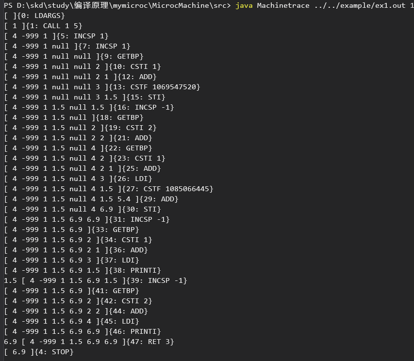

---


- 变量定义时赋值

  - 原本的microC只有变量的声明，不可在声明的时候进行赋值，我们改进了它，使其可以在声明时赋值，并且全局环境和local环境都可实现

  - 例子：

    ```C
    // old
    int a;
    a = 3;
    int main(){
        print a;
    } 
    ```

    ```C
    // new (ex2_1.c)
    float a = 1.5;
    void main() {
    	int b = 2;
    	print a;
    	print b;
    }
    
    ```
    
   - 堆栈图：


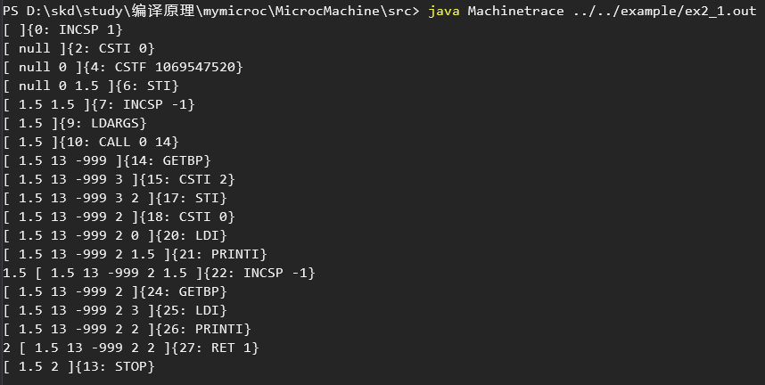


- char类型的实现

  - 原本的microC并没有char类型，我们添加了这一个类型。得益于之前对于java虚拟机的改进，我们只需要新增一个baseType的charType子类。就可以继续用改进之后的java虚拟机进行out文件的执行和输出。同样的，在储存形式上我们也使用net自带的(int32)（System.BitConverter.ToInt16((System.BitConverter.GetBytes(char(i))),0)）函数对char进行转换，方便存储。
  - 例子：
  
    ```C
    // (ex3_1.c)
    void main(int n) { 
    	char a= 'a';
    	print a;
    	print 'S';
    }
    
    ```
  
   - 堆栈图：
  
     在这里CSTC直接存入了a，不过在out文件中还是以ASCII码的形式进行存储。如97对应a。
     
     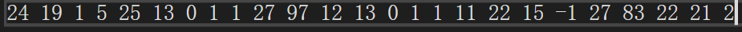
     
     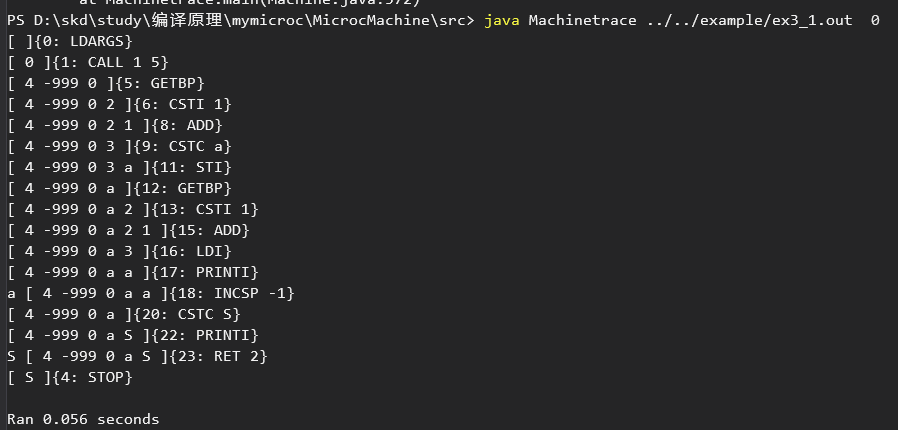

---

- 三目运算符（a?b:c）的实现

  - 原本的microC并没有三目运算符。只有单目和双目运算符，我们增加了三目运算符这一特性进行运算。
  - 例子：
  
    ```C
    // (ex4.c)
    void main(int n) { 
    	int a = 5;
    	int b=4;
    	b = a ? 1 : 0;
    	print b;
    }
    ```
  
   - 堆栈图：
  
     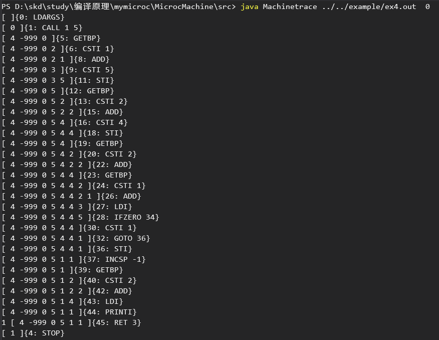

---

- 自增自减的实现

  - 由于是即时解释运行，所以i++和++i没有不同，都是先加给自身在进行其他操作。自减操作同理。
  - 例子：
  
    ```C
    // (ex1.c)
    void main(int n) {
      float a;
      float b;
      a = 1.5;
      b = a + 5.4;
      print a;
      print b;
    }
    ```
  
   - 堆栈图：
  
     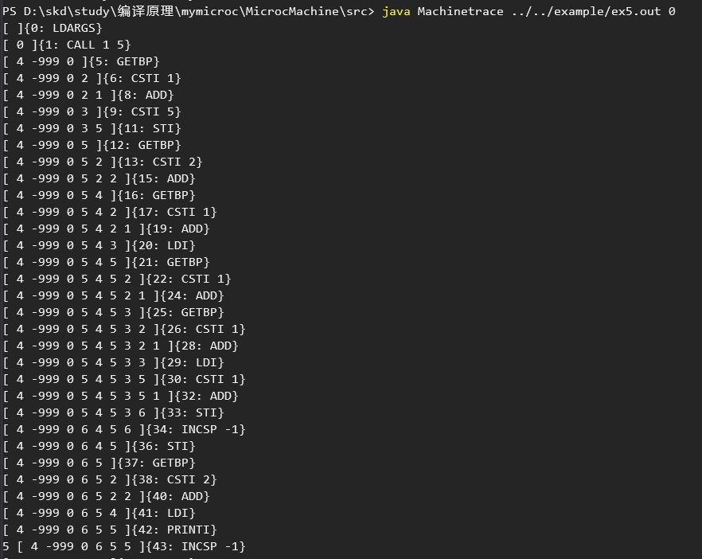
     
     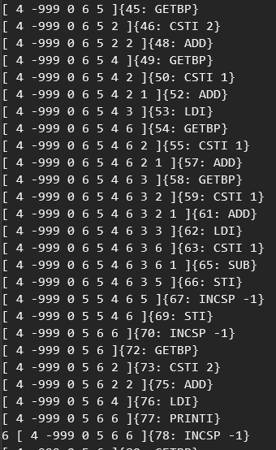
     
     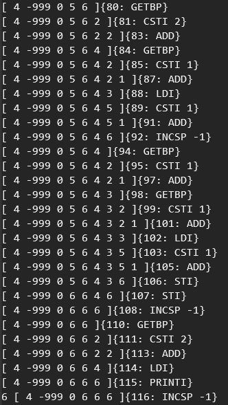
     
     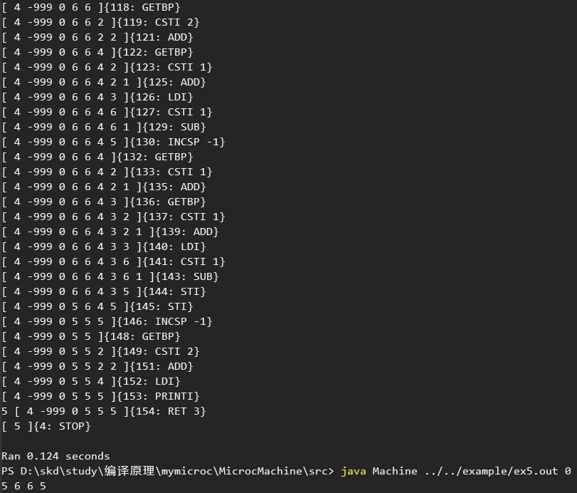

---

- switch-case的实现

  - 原本的microC并没有实现switch-case，我们实现了switch-case，同时也增加了break，使其和C语言中的switch-case基本一致，且default的位置也没有固定在末尾。不过由于我们switch的逻辑是对case进行依次匹配，若满足case的条件则运行case中的语句，而我们编写的default则是一种另类的case，是无论条件如何都会满足的case，所以一旦放在首位，则会率先运行default，这一点和C语言中有所不同。
  - 例子：
  
    ```C
    // (ex6_1.c)
    void main(int n) {
    	switch (n){
    		case 1: {
    			print 'a';
    			break;
    		}
    		case 2: {
    			print 'b';
    		}
    		case 3: {
    			print 'c';
    			break;
    		}
    		default: {
    			print 's';
    			break;
    		}
    	}
    }
    ```
  
   - 堆栈图：
  
     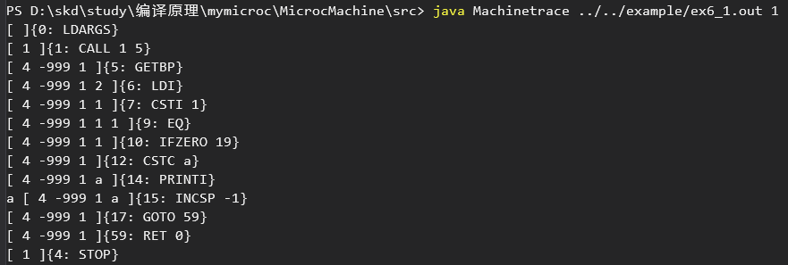
     
     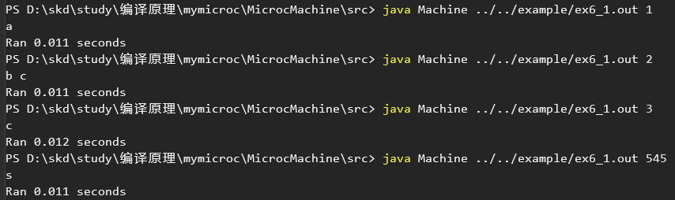
     
     如果default放在首位则会出现下面的情况：
     
     可以看到我们虽然有满足了case 1，但是还是直接运行了default语句，并且由于break的缘故直接跳出了switch语句，这一点我们并没有和C语言一致，因为我们的逻辑有所不同，可以在之后进行改进。
     
     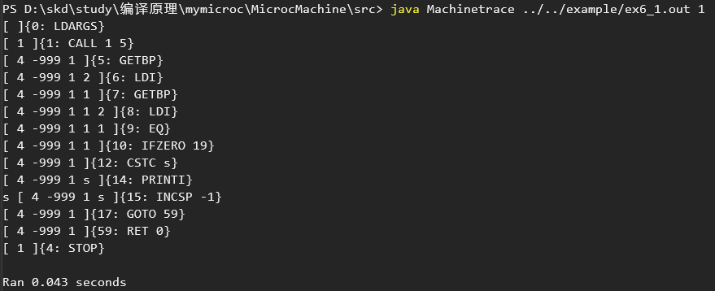

---

- for循环的实现

  - 原本的microC并没有for循环，但是有while循环，所以实现for循环也比较容易。
  - 例子：
  
    ```C
    // new (ex7_1.c)
    void main() {
        int i;
        i = 0;
        for (i = 0; i < 10; i++) {
            print i;
        }
        print 'N';
    }
    ```
  
   - 堆栈图：
  
     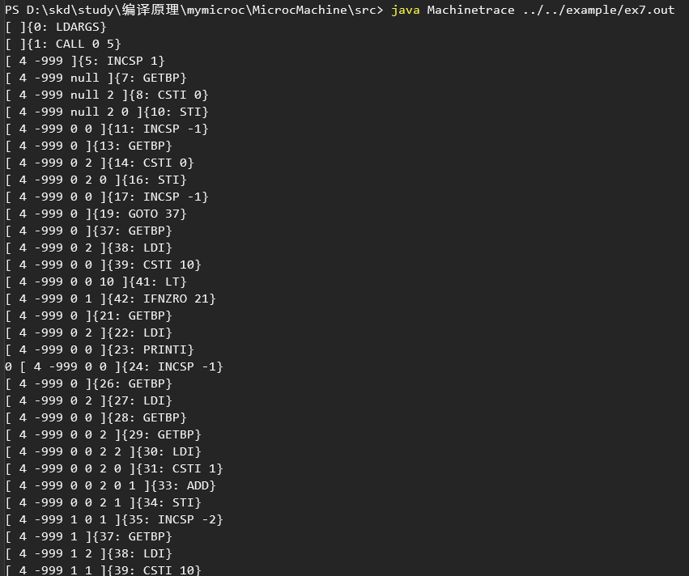
     
     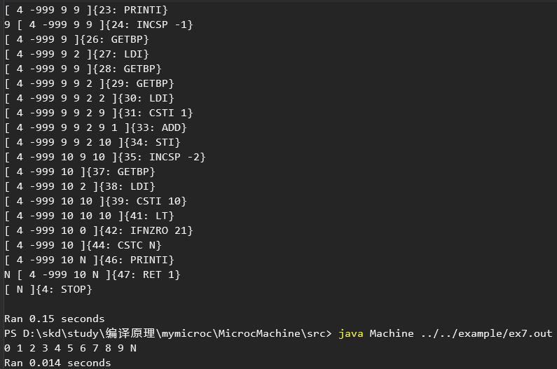
     
     由于for循环的堆栈较多，就不全部展示了，不过从一次循环的堆栈中也可以看出正常的逻辑。

---
- continue，break的实现

  - 原本的microC并没有continue和break，我们增加了continue和break，同时break在switch中也有所介绍，因为逻辑都是一样，都只是跳出运行的语句块，所以可以一起使用。
  
  - 例子：
  
    ```C
    // new (ex8.c)
    void main() {
    	int i;
    	for (i = 1; i <= 10; i++) {
    		if (i % 2 == 0) {
    			continue;
    		}
    		print i;
    	}
    	print 'S';
    	for (i = 1; i <= 10; i++) {
    		if (i == 6) {
    			break;
    		}
    		print i;
    	}
    }
    ```
  
   - 堆栈图：
  
     由于for循环的堆栈较多，就不全部展示了，下面是continue语句的堆栈，可以看到当判断完之后没有运行print，而是直接跳转到了for语句的开头开始下一次的循环。
     
     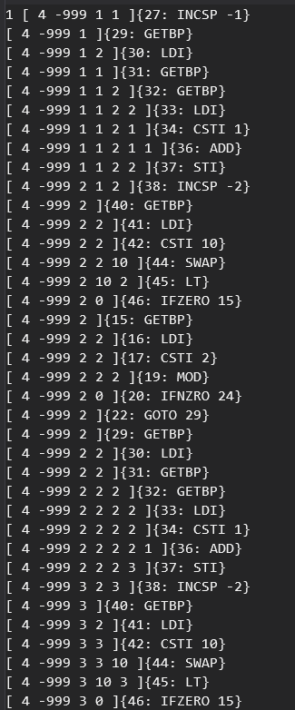
     
     下面是break在循环中的展示，在进行一次ifzero判断后直接goto94，结束了循环。
     
     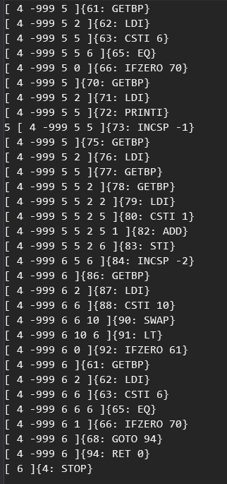
     
     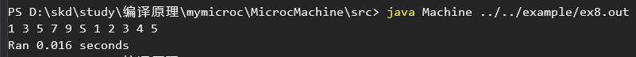

---
- dowhile循环的实现

  - 原本的microC并没有dowhile循环，但是有while循环，所以实现dowhile循环也很容易，比for循环的实现更加简便。
  - 例子：
  
    ```C
    // new (ex9.c)
    void main(int i) {
    	do {
    		print i;
    		i++;
    	} while (i <= 10);
    	printc 'S';
    }
    
    ```
  
   - 堆栈图：
  
     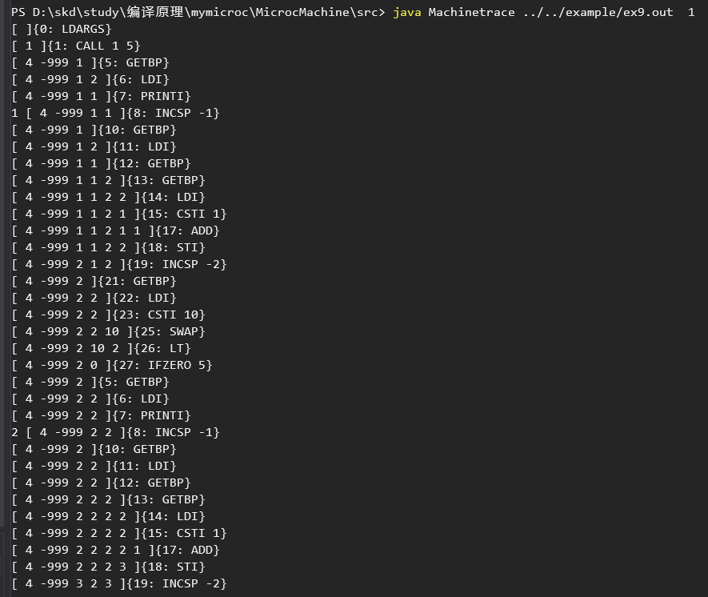
     
     由于循环的堆栈较多，就不全部展示了，不过从一次循环的堆栈中也可以看出dowhile的逻辑，先执行了一次循环体的语句，直接输出了1，之后再进行循环的判断，继续循环。

---
- try-catch的实现

  - 原本的microC并没有try-catch，try-catch的特性比较的高级，也比较的困难，在添加这一部分特性的时候遇到了许多的困难。一开始用labellist进行跳转的想法难以实现，后面还是借鉴了cuby的实现方式，采用了增加两个命令，push和pop到机器码的层面，才能比较完好的实现。通过这两个命令，当异常出现时依次在push的结点进行检查，如果满足则进行语句的执行，也就是异常被catch到了，但是总体还是较难，所以还是只实现了一个异常，也就是除数为0的异常检查，并进行catch。
  - 例子：
  
    ```C
    // new (ex10.c)
    void main(int n) {
        try {
            int a = 0;
            int n = 5;
            n = n / a;
        }
        catch ("ArithmeticalExcption")
        {
            n = 0;
            print n;
        }
    }
    ```
  
   - 堆栈图：
  
     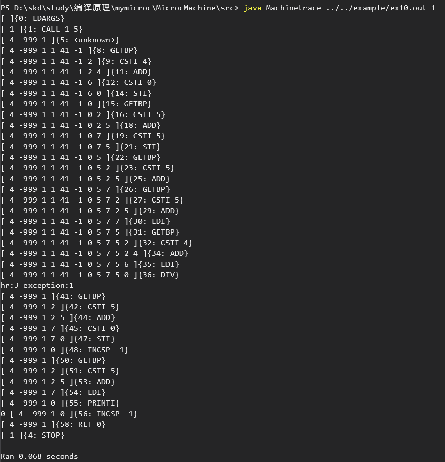
     
     可以看到，在除数为0之后出现了报错，然后被catch捕获并提示是在哪里捕捉，其中3为catch的地址，hr为用push和pop单独维护的一个每个catch的栈的地址。

---
- finally的实现

  - 原本的microC并没有finally，用于借鉴的cuby中也仅有try-catch并没有finally的实现过程，我在阅读之后发现，读取catch的逻辑和switch中读取case的逻辑基本一致，当时我在添加default的时候也是把default当做一个另类的case，所以现在我就把finally包装成了一个另类的catch，并且在fianlly之后强制程序结束，用于贴近java中的trycatch机制。而且由于finally一定会在catch之后出现，所以我在switchcase中default的窘境在这里反而成为了一个契合的特点。
  - 例子：
  
    ```C
    // new (ex11.c)
    void main(int n) {
        try {
            int a = 0;
            int n = 5;
            n = n / a;
        }
        catch ("ArithmeticalExcption")
        {
            n = 0;
            print n;
        }
        finally {
            print 's';
        }
        print 'k';
    }
    ```
  
   - 堆栈图：
  
     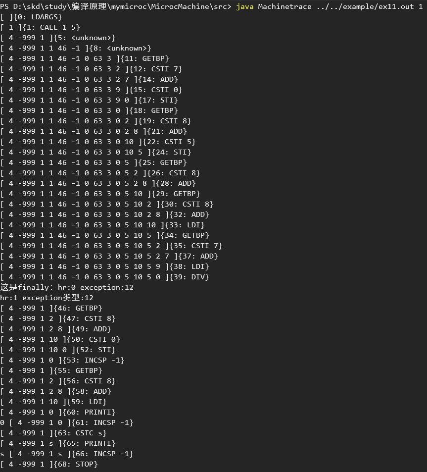
     
     在异常出现的时候会进行异常的提示，然后再去运行异常内部的语句，而进行提示的时候，也是把hr指针从异常栈底移到栈顶的过程，所以先报出来的是finally错误（为了说明，可以隐去），然后则是他自己的错误，即hr为1的错误，当移到栈顶之后，则进行依次遍历，如同switch中寻找case一样，依次配对，运行，不过在finally的末尾我增加了一个stop命令，强制终止这个程序所以k并没有被打印出来。

---
- and，or，xor的实现

  - 原本的microC有&&和||但这个是顺序与和顺序或，和一般的与和或逻辑不一致，所以我新增了三个符号“&&&”，“|||”和“|&|”，分别表示与，或，异或
  - 例子：
  
    ```C
    // new (ex12.c)
    int main() {
    	int a;
    	a = 3 &&& 2;
    	print a;
    	a = 1 ||| 0;
    	print a;
    	a = 1 |&| 1;
    	print a;
    }
    
    ```
  
   - 堆栈图：
  
     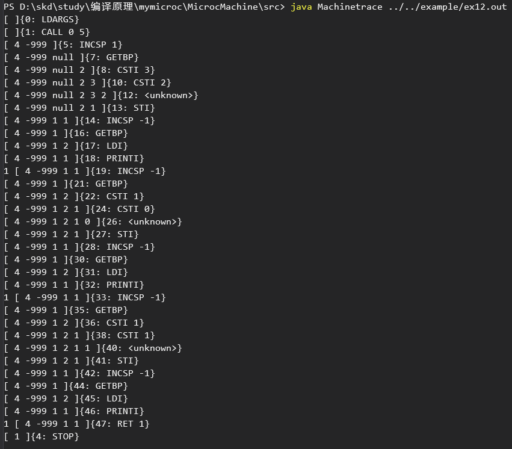
---

#### 解释器：

由于解释器和编译器的实现逻辑有所不同，所以在编译器中实现的功能有些在解释器中尚未实现，并且有些地方有少许出入。需要之后进行改进。

- float类型的实现

  - 由于解释器中需要即时输出，所以不能使用java的子类继承的方法进行实现，经过查询微软的net文档之后，可以用类型转换直接实现，同样的要考虑到即时的类型判断，所以我在这里添加了一个printf，通过输入的符号进行类型判断。
  - 例子：
  
    ```C
    // (ex1_1.c)
    void main(int n) {
      float a;
      a = 1.5;
      printf("%f",a);
    }
    ```
    
   - 输出：
  
     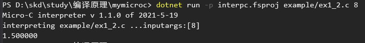

---


- 变量定义时赋值

  - 没有实现全局变量的定义时赋值，有点缺陷。

  - 例子：

    ```C
    // old
    int a;
    a = 3;
    int main(){
        print a;
    } 
    ```

    ```C
    // new (ex2_1.c)
    void main() {
    	float a = 1.5;
    	int b = 2;
    	printf("%f", a);
    	printf("%d", b);
    }
    ```
    
   - 输出：


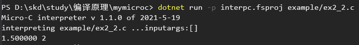


- char类型的实现

  - 和编译器一直，print语句有所不同。
  - 例子：
  
    ```C
    // (ex3_1.c)
    void main() { 
    	char a= 'a';
    	printf("%c",a);
    	printf("%c",'S');
    }
    ```
  
   - 输出：
  
     由于是即时输出，所以很简洁。
     
     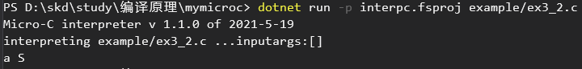

---

- 三目运算符（a?b:c）的实现

  - 和编译器一致
  - 例子：
  
    ```C
    // (ex4.c)
    void main(int n) { 
    	int a = 5;
    	int b=4;
    	b = a ? 1 : 0;
    	print b;
    }
    ```
  
   - 输出：
  
     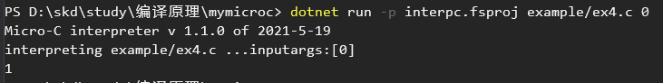
---

- 自增自减的实现

  - 原本的microC并没有自增和自减，我们添加了这一操作，同时包含了++i,--i,i++,i--这四个。
  
  - 例子：
  
    ```C
    // (ex5.c)
    void main(int n) {
    	int a = 5;
    	int n = a++;
    	print n;
    	n = a--;
    	print n;
    	n = ++a;
    	print n;
    	n = --a;
    	print n;
    }
    ```
  
   - 输出：
  
     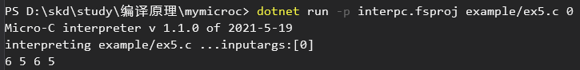
     
     可以看到和编译器的输出5 6 6 5有所不同。
---

- switch-case的实现

  - 解释器中的switch-case和编译器中的switch有比较大的不同，由于解释器这边是即时的环境存储，所以没有如编译器中用labellist串起所有的case，而是相当于自带break一般直接跳出switch。
  - 例子：
  
    ```C
    // (ex6_2.c)
    void main(int n) {
    	switch (n){
    		case 1: {
    			printf("%c" ,'a');
    		}
    		case 2: {
    			printf("%c", 'b');
    		}
    		case 3: {
    			printf("%c", 'c');
    		}
    		default: {
    			printf("%c", 'S');
    		}
    	}
    }
    ```
    
   - 输出：
  
     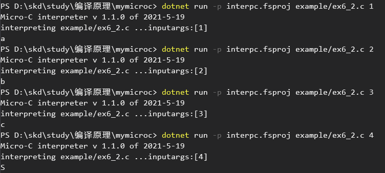
---

- for循环的实现

  - 和编译器一致
  - 例子：
  
    ```C
    // new (ex7_2.c)
    void main() {
        int i;
        i = 0;
        for (i = 0; i < 10; i++) {
            print i;
        }
        print 'N';
    }
    ```
  
   - 输出：
  
     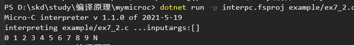

---
- continue，break未在解释器中实现


由于我们没有再解释器中实现labellist用于建立和维护label，所以我们没有实现break和continue，暂且不表。

---
- dowhile循环的实现

  - 和编译器一致
  - 例子：
  
    ```C
    // new (ex9.c)
    void main(int i) {
    	do {
    		print i;
    		i++;
    	} while (i <= 10);
    	printc 'S';
    }
    
    ```
  
   - 输出：
  
     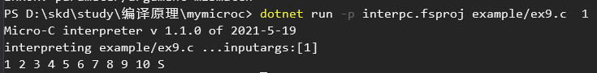

---
- try-catch和finally的实现


同样由于确实labellist 的原因，我们也没有在解释器中实现trycatch相关的特性。

---
- and，or，xor的实现

  - 和编译器中一致
  - 例子：
  
    ```C
    // new (ex12.c)
    int main() {
    	int a;
    	a = 3 &&& 2;
    	print a;
    	a = 1 ||| 0;
    	print a;
    	a = 1 |&| 1;
    	print a;
    }
    
    ```
  
   - 输出：
  
     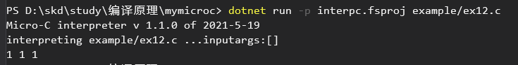
---
#### 虚拟机：

- 介绍：

  由于使用比较普遍的C#虚拟机中的栈是用int数组作为储存的，当我在添加float类型时遇到了储存和输出的困难，但是我们不太出席C#，java作为一种比较熟悉的语言，而它面向对象的特性也能完美发挥，通过类型继承来使得各个类型之间的转换。

- 类的继承关系：

  BaseType是父类，

  IntType，FloatType，CharType都是BaseType的子类。

- 指令集添加：

  - CSTF =26：

    在堆栈中增加一个float型的数据

  - CSTC =27：

    在堆栈中增加一个char型的数据

  - THROW = 28：

    抛出异常

  - PUSHHR = 29：

    保存catch中的异常种类，需要跳转的地址并让hr新增的这个寄存器入栈

  - POPHR = 30：

    出栈，与PUSHHR相对应

  - AND =31：

    与运算

  - OR=32：

    或运算

  - XOR=33：

    异或运算

- 增加的try-catch：

  目前只有一个除0时的异常捕获。同时用字符串的方式来进行异常的匹配。当有异常发生的时候，hr从栈底遍历到栈顶，依次进行配对，用于提示异常类型。这样重新到了栈顶，再次进行匹配，被catch捕捉之后再运行对应的语句。而finally由于在最后的位置，所以一定是运行完catch之后才会轮到finally，同时我在finally之中增加了stop指令，和java中的try-catch一致。

## 心得体会

- 沈科迪：  
  对于编译原理这一门课，我一开始是十分头疼的，不仅仅是因为抽象语法树，词法，语法分析这些难以理解的概念，还有就是F#这一门又陌生，网络上资料又少的这门函数式语言。当时第一次作业的语言分析我本来就是想写F#，但是资料实在是太少了，所以后来换了ruby进行语言报告。但是这一次的大作业又不得不进行学习，所以很痛苦的进行学习。一开始毫无头绪，只能看着cuby推测每个代码的作用，但是到后来就慢慢了解了，也渐渐体会到了F#这一门语言一些优越的特性，别的不说，这个let就是F#最佳的展现，他几乎是万能的，不仅能定义变量还能定义函数，还能充当placeholder的作用，让我看到了一开始在ruby中看到的编程的魅力所在。通过这次大作业，我也收获了许多东西。

  - 重新认识了函数式编程的语言特点与特性，开拓了眼界。
  - 利用F#与java完善了一个编程语言的编译器，解释器，虚拟机。
  - 对于编译原理有了更深一步的理解，以前课上一些没有理解的知识现在也有所涉猎。
  - 理解了栈式虚拟机的工作原理与一些设计方法
  - 利用虚拟机避免与汇编指令集直接打交道，优化代码执行策略   

  编译原理还是很值得玩味的，他是无穷尽的，你可以一直在其中增加你想要的东西，我这次只是在cuby的引导下慢慢的了解了一点编译原理的知识和实现方法，还是感到了自己对于这部分的不足，自己增加的特性看起来已经很难的，但是在实际的编译原理中都是比较简单的东西。之后还可以进行进一步的学习，可以往虚拟机中加入全局静态变量表、增加结构体，在编译器中加入头文件机制、编译到X86等等各种机制。

  总而言之，这节编译原理课，这次大作业，收获颇丰，F#好用值得学习。编译原理的世界是十分广袤的，值得去探索，值得去学习，值得去细细品味细节。 

- 林承毅：  
  本学期的编译原理学习，是非常需要时间和精力的投入的。无论是之前每个星期的单次作业以及期末的大作业，都需要投入一定的精力去了解，去学习在编译之中理论以及实践的内容。而在期末大作业做一个简单的C语言（相当于自己DIY的小玩意）的过程中，各种编译原理的知识，对于函数式语言的应用，对于每个环节的统一，感觉都对计算机专业的学习有着极大的帮助。这些学习让我更深一步了解一些语言模型，机器模型，语义语法结构等。的确，大学就应该加深对于计算本质的理解与运用，有了本质的了解才能在之后的应用中更加了然于心。
  个人简单的总结：

  - 大作业完成中，对指令与栈结构还有语法分析等等编译原理的基本知识有了更深的了解，也认识到了这其中值得学习的地方。
  - 随着对F#的使用越加频繁，也加深了对函数式编程语言的理解，之前对于C语言的简单学习并不支持F#的使用，需要有更深的理解。不过C语言的学习也是帮助我能够看懂F#的代码。能够进行更深的学习。
  - 过程的积累中，逐渐了解一些编译的理念，计算的思维，计算的内核。
  - 在大作业有些功能的完成上，比较仓促，而且有些还没有完全理解，需要更进一步的学习让这个玩具型的语言能够有更高的层次。


## 技术评价

| 功能            | 对应文件 | 优   | 良   | 中   |
| --------------- | -------- | ---- | ---- | ---- |
| float类型       | ex1_1.c  | √    |      |      |
| 变量声明时赋值  | ex2_1.c  | √    |      |      |
| char类型        | ex3_1.c  | √    |      |      |
| 三目运算符      | ex4.c    | √    |      |      |
| 自增自减        | ex5.c    | √    |      |      |
| switch-case     | ex6_1.c  |      | √    |      |
| for循环         | ex7_1.c  | √    |      |      |
| break和continue | ex8.c    | √    |      |      |
| do-while循环    | ex9.c    | √    |      |      |
| try-catch       | ex10.c   |      | √    |      |
| finally         | ex11.c   | √    |      |      |
| 逻辑运算符      | ex12.c   | √    |      |      |


## 小组分工

- 沈科迪
  - 学号：31803224
  - 班级：计算机1803
    - 工作内容
      - 文档编写
      - float，char的定义
      - 虚拟机改进
      - switch break的实现
      - break continue的实现
      - try-catch实现
- 林承毅
  - 学号：31803225
  - 班级：计算机1803
    - 工作内容
      - 测试程序
      - 实现定义变量时赋值
      - 三目运算符，自增自减实现
      - for，do-while循环实现
      - finally
      - 逻辑符号实现
      - 解释器中代码的增加

- 权重分配表：  

| 沈科迪 | 林承毅 |
| ------ | ------ |
| 0.95   | 0.95   |
